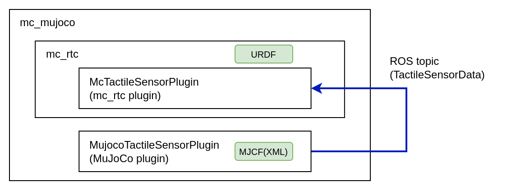

## System details for using tactile sensor with mc_mujoco

### Data flow
MujocoTactileSensorPlugin (MuJoCo plugin) simulates the tactile sensor and publishes the data as a ROS topic. Then, McRtcTactileSensorPlugin (mc_rtc plugin) subscribes the data and sets them as measured values in mc_rtc's force sensor.



To use MujocoTactileSensorPlugin with `mc_mujoco`, the following description must be added to `${HOME}/.config/mc_rtc/mc_mujoco/mc_mujoco.yaml`:
```yaml
PluginPaths: ["<path to catkin workspace>/devel/.private/mujoco_tactile_sensor_plugin/lib"]
```

### Model and configuration files

Typical descriptions of tactile sensors in the model and configuration files are as follows:

- MJCF (XML)
   - The `site` (i.e., frame) of the tactile sensor (\#Frame1)
   - `topic_name` to publish the tactile sensor data
- URDF
   - Dummy (fixed) joint and link for the frame of the tactile sensor (\#Frame2)
- mc_rbdyn::RobotModule
   - Force sensor frame (\#Frame3)
- Configuration file of the mc_rtc controller (e.g., YAML)
   - Frame of contact (\#Frame4)
- Configuration file of McRtcTactileSensorPlugin (e.g., YAML)
   - Frame name of the tactile sensor defined in the URDF
   - Force sensor name defined in the mc_rbdyn::RobotModule
   - Topic name defined in the MJCF

These descriptions are subject to the following constraints:

- The parent link of \#Frame1, \#Frame2, \#Frame3, and \#Frame4 must all be identical.
- The locations of \#Frame1 and \#Frame2 must be identical.
- The locations of \#Frame1 and \#Frame3 do not have to be the same; dummy location (e.g., Identity) is acceptable for \#Frame3.
- The locations of \#Frame1 and \#Frame4 do not have to be the same; however, they are the same in the main test case.
